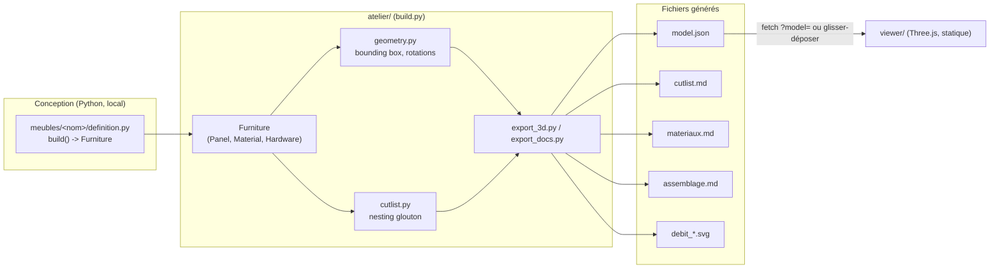
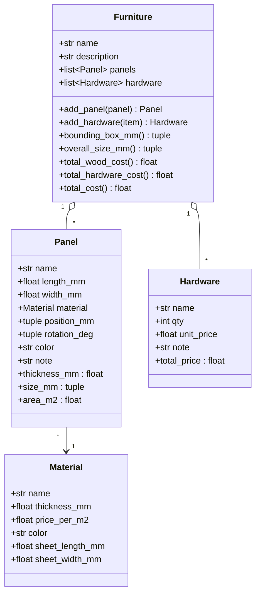
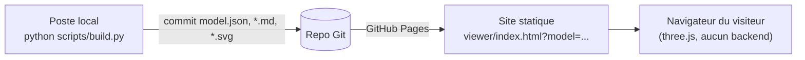

# House-construction — Atelier meubles

Assistant de conception de meubles : on définit chaque meuble en Python
(dimensions réelles, panneaux, quincaillerie), et le projet génère
automatiquement :

- un **modèle 3D à l'échelle réelle**, consultable dans un navigateur (`viewer/`) ;
- un **plan de débit** (liste des panneaux + optimisation de découpe sur plaques) ;
- une **fiche matériaux & coût** ;
- une **notice de montage**.

Un dossier = un meuble, dans `meubles/` (voir [meubles/README.md](meubles/README.md)).

## Pipeline



Le Python (`atelier/`) tourne uniquement au moment de la conception, en
local. Il ne s'exécute jamais dans le navigateur : seul `model.json` (et le
visualiseur statique) est servi à l'utilisateur final.

## Démarrage rapide

```bash
python3 scripts/build.py meubles/exemple_etagere
python3 -m http.server        # à la racine du repo
# puis ouvrir : http://localhost:8000/viewer/index.html?model=/meubles/exemple_etagere/model.json
```

Le visualiseur fonctionne aussi sans serveur : ouvrez `viewer/index.html`
directement dans le navigateur et glissez-déposez le fichier `model.json`
du meuble (ou choisissez-le via le sélecteur de fichier). Détails et
déploiement en ligne : [viewer/README.md](viewer/README.md).

## Créer un nouveau meuble

1. Copier `meubles/exemple_etagere/` vers `meubles/<nom_du_meuble>/`.
2. Éditer `definition.py` : décrire les panneaux (dimensions réelles en mm,
   position, rotation, matériau) et la quincaillerie. C'est le fichier
   qu'on modifie ensemble pendant la conception.
3. Lancer `python scripts/build.py meubles/<nom_du_meuble>` : ça régénère
   `model.json`, `cutlist.md`, `materiaux.md`, `debit_*.svg`, et crée
   `assemblage.md` s'il n'existe pas déjà (un `assemblage.md` existant
   n'est jamais écrasé, pour ne pas perdre vos notes de montage).
4. Ouvrir le résultat dans le visualiseur pour vérifier l'échelle et les
   proportions.

## Modèle de données (`atelier/`)



- **Convention d'axes** (comme three.js) : **Y = hauteur**, X/Z = plan
  horizontal (sol). Dimensions locales d'un `Panel` avant rotation :
  `length_mm` = X, `width_mm` = Y, épaisseur du matériau = Z.
  `position_mm` = centre du panneau, `rotation_deg` = Euler (rx, ry, rz)
  en degrés (voir `atelier/geometry.py`).

Un `definition.py` définit une fonction `build() -> Furniture` :

```python
from atelier import Furniture, Panel, Material, Hardware

CTP = Material(name="Contreplaqué 18mm", thickness_mm=18, price_per_m2=32.0)

def build() -> Furniture:
    f = Furniture(name="Mon meuble")
    f.add_panel(Panel(name="Côté gauche", length_mm=1800, width_mm=300,
                       material=CTP, position_mm=(-391, 900, 150),
                       rotation_deg=(90, 0, 90)))
    f.add_hardware(Hardware(name="Vis 4x40", qty=12, unit_price=0.05))
    return f
```

## Plan de débit / nesting

`atelier/cutlist.py` regroupe les panneaux identiques et optimise leur
placement sur des plaques standard (taille définie par matériau) avec un
algorithme glouton de type *shelf packing* (premier ajustement décroissant,
rotation à 90° testée). Le résultat est exporté en markdown (`cutlist.md`)
et en plan visuel SVG (`debit_<matériau>.svg`) — pratique à imprimer pour
l'atelier. Un panneau qui ne tient sur aucune plaque fait lever une
`ValueError` explicite plutôt que de disparaître silencieusement.

## Visualiseur 3D (`viewer/`)

Page statique en Three.js (chargé depuis un CDN, pas d'installation) :
rotation/zoom libres (OrbitControls), panneaux cliquables (met en évidence
le panneau et affiche ses cotes), grille au sol de 1 m, et une silhouette
humaine de 1,75 m activable pour juger l'échelle d'un coup d'œil.

## Déploiement

Pas de VM ni de serveur applicatif nécessaire : `viewer/` est un site
100% statique (HTML/JS/JSON, three.js via CDN). Python ne sert qu'au
build local des fichiers, qui sont ensuite commités dans le repo.



Détails d'activation GitHub Pages, limites du `fetch()` en local, et
solution de repli (glisser-déposer) : voir
[viewer/README.md](viewer/README.md).

## Tests

```bash
python3 -m unittest tests.test_atelier -v
```

## Prochaines pistes

- Vue AR (WebXR) pour poser le meuble à l'échelle 1:1 dans la pièce via
  la caméra du téléphone.
- Détection de collisions entre panneaux lors de la conception.
- Export du plan de débit en PDF.
- GitHub Action pour relancer `build.py` automatiquement à chaque push.
