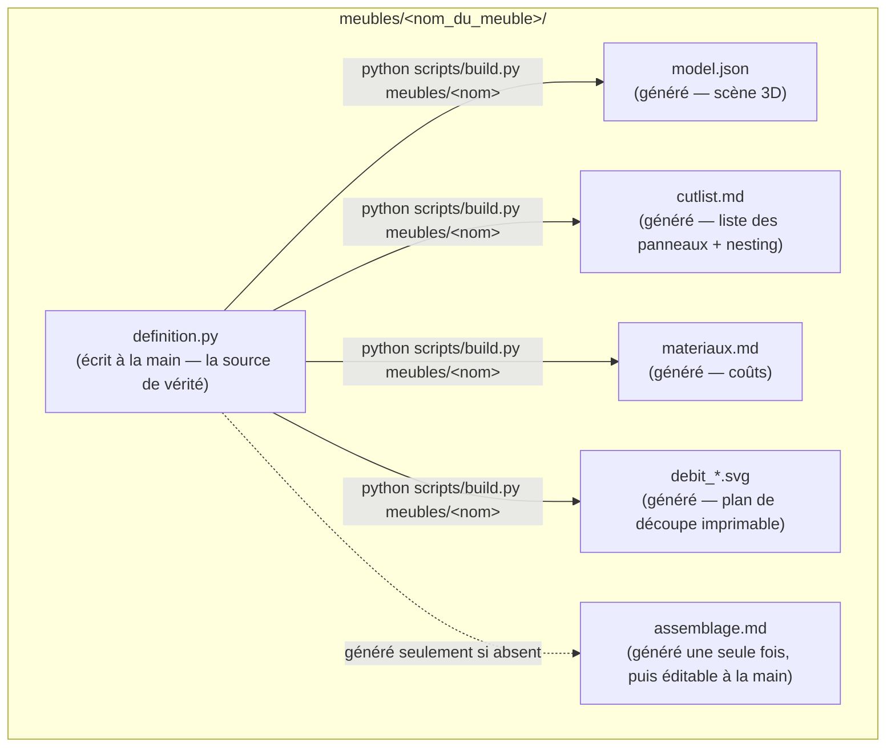

# `meubles/` — un dossier = un meuble

Chaque sous-dossier décrit un meuble et regroupe sa définition et tous les
fichiers générés à partir d'elle.

Seul `definition.py` (et les éventuelles notes ajoutées dans
`assemblage.md`) doit être édité à la main ; tout le reste est régénéré par
`python scripts/build.py meubles/<nom_du_meuble>` et peut être supprimé et
reconstruit sans perte.

## Créer un meuble

1. Copier `exemple_etagere/` vers `<nom_du_meuble>/`.
2. Adapter `definition.py` : cotes réelles en mm, panneaux, quincaillerie
   (voir le README principal pour le modèle de données `atelier/`).
3. `python scripts/build.py meubles/<nom_du_meuble>`
4. Vérifier l'échelle et les proportions dans le visualiseur (`viewer/`).

## `exemple_etagere/`

Étagère murale 3 tablettes (800 × 1800 × 300 mm) servant de référence :
elle illustre panneaux verticaux/horizontaux, rotations, fond rigide et
quincaillerie, et valide le pipeline complet de bout en bout.
