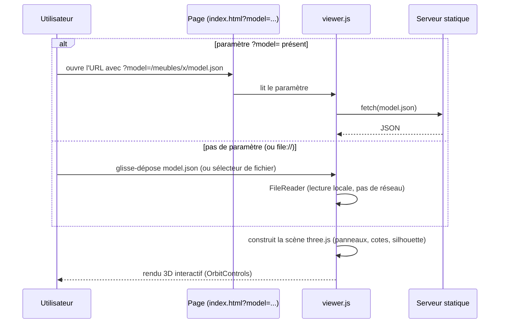

# `viewer/` — visualiseur 3D à l'échelle réelle

Page statique (HTML + JS module, Three.js chargé depuis un CDN via
importmap) : aucune installation, aucun backend. Elle affiche un
`model.json` généré par `scripts/build.py` avec les vraies dimensions
(en mètres), une grille au sol de 1 m et une silhouette humaine de 1,75 m
pour juger l'échelle d'un coup d'œil.

## Chargement du modèle



Le `fetch()` du mode `?model=` échoue sur `file://` (restriction CORS des
navigateurs) : il faut soit un serveur http, soit passer par le
glisser-déposer, qui fonctionne dans tous les cas.

## Utilisation locale

```bash
python3 -m http.server        # à la racine du repo
# http://localhost:8000/viewer/index.html?model=/meubles/exemple_etagere/model.json
```

Ou, sans rien lancer : ouvrir `viewer/index.html` directement dans le
navigateur et glisser-déposer un `model.json`.

## Déploiement (GitHub Pages)

Aucune VM requise : c'est un site 100% statique.

1. Settings → Pages → Source = la branche du projet, dossier racine (`/`).
2. Le viewer est alors accessible sur :
   `https://<utilisateur>.github.io/<repo>/viewer/index.html?model=/meubles/<nom>/model.json`
3. Les `model.json` doivent être commités dans le repo (ils le sont déjà
   pour `meubles/exemple_etagere/`) — GitHub Pages ne sait pas exécuter le
   Python de `atelier/`, seulement servir les fichiers générés.

D'autres hébergeurs statiques (Netlify, Vercel, Cloudflare Pages)
fonctionnent à l'identique.
